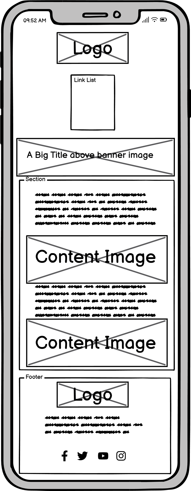

# Milestone_project_1
Hi! My name is Morgan Jenkins and this will be the first Milestone project for my Code institute course.

## Project Description
This website will be a fitness website that will include a landing page, 5 exercise pages based on different muscle groups and a form page for applying for personalised workout plan. It will inform the user about the benefits of exercise, inform them about muscle groups and provide a resource for a number of exercises.

# Table of Contents

1. [Project Development and Planning](#project-development-and-planning)
    * [Goals](#goals)
        * [Project inspiration](#project-inspiration)
        * [Purpose of the project](#purpose-of-the-project)
        * [User Goals](#user-goals)
    * [Design and structure](#design-and-structure)
        * [Wireframes](#wireframes)
        * [Intended Structure](#intended-structure)
        * [Colours and Font Design](#colour-and-font-design)

2. [Code and Tools](#code-and-tools)
    * [Languages Used](#languages-used)
    * [Tools and technologies](#tools-and-technologies)

3. [Website pages and features](#website-pages-and-features)
    * [Site Wide Features](#1-site-wide-features)
        * [Logo](#logo)
        * [Nav Bar](#nav-bar)
        * [Banner Image](#banner-image)
        * [Footer](#footer)
    * [Content Pages](#2-content-pages)
        * [Home/Landing Page](#homelanding-page)
        * [Exercise Page](#exercise-page)
        * [Personal Training Page](#personal-training-page)

4. [Testing](#testing)
    * [HTML Validation](#html-validation)
        * [Index Page](#index-page)
        * [Exercise Pages](#exercise-pages)
        * [Personal Workout Page](#personal-workout-page)
    * [CSS Validation](#css-validation)
    * [Performance tests](#performance-tests)
        * [Home Page](#home-page)
        * [Exercise Pages](#exercise-pages-1)
            * [Leg exercise page](#leg-exercise-page)
            * [Core exercise page](#core-exercise-page)
            * [Back exercise page](#back-exercise-page)
            * [Shoulder exercise page](#shoulder-exercise-page)
            * [Arm exercise page](#arm-exercise-page)
        * [Personal Workout Page](#personal-workout-page-1)
        * [Accessibility tests](#accessibility-tests)
            * [Home Page](#home-page-1)
            * [Exercise Pages](#exercise-pages-2)
                * [Leg exercise page](#leg-exercises)
                * [Core exercise page](#core-exercises)
                * [Back exercise page](#back-exercises)
                * [Shoulder exercise page](#shoulder-exercises)
                * [Arm exercise page](#arm-exercises)
            * [Personal Workout Page](#personal-workout-page-2)
        * [Bug Fixes](#bug-fixes)
        * [Responsiveness](#responsiveness)

5. [Deployment](#deployment)
    * [Deploying to Github Pages](#deploying-to-github-pages)
    * [Forking the githubrepository](#forking-the-github-repository)
    * [Cloning the repository](#cloning-the-github-repository)

6. [Credits](#credits)
    * [Code](#code)
    * [Content](#content)
    * [Photos](#photos)
    * [Acknowledgments](#acknowledgements)

## Project Development and Planning
I planned this project with a focus on User goals and UX, including the 5 planes of Strategy, Scope, Structure, Skeleton & Surface. I wanted to make sure the website was easily accessible and responsive.

### Goals

#### Project inspiration
My inspiration for this project came from my shift from a more active job to an office based job where I work at a computer. I noticed an increase in my weight and a lowering in my mood which was reversed when I began consistent exercise. I would imagined this is a scenario other office workers find themselves in and so I wanted to create a website for them.

#### Purpose of the project
To create a simple to use and accessible website with a list of easy to perform exercises and outlining the benefits of them. 
#### User Goals
1. To understand the benefits of exercise on physical and mental wellbeing.
2. Have exercise to a repository of different exercises based on muscle group.
3. Access to a contact form for a personalised workout plan.
4. To feel empowered to begin exercising.

It was through these user goals that I defined the scope and purpose of this website.

## Design and Structure

### Wireframes

I used Balsamiq to create the basic structure for the website. After looking at other fitness websites I decided to keep the basic structure for the desktop and tablet display to be the same. Any changes between these two in the finished project would be as a result of responsiveness as it pertains to UX priciples.

Desktop and tablet wireframe

 

The mobile site would be different however, I believed a vertically aligned webpage with all the items sequentially would be ideal as this is intended for first time exercisers so it would be important for them to see all the information on the webpage and it would follow the design of more common mobile applications e.g. news feeds.

Mobile wireframe

 

### Intended Structure

There are three main components that make up this website.

1. The home/landing page: This is where the User will begin read a little about the benefits of exercise and be enticed to read about the exercises.

2. The exercise pages: These will be split over 5 pages related to their muscle groups. That way more experienced users can find something they are looking for straight away and beginners can learn what exercises effect which muscles.

3. Personal Workout page: This will be a form submission page where the user can list their information and submit a request for a personalised workout. (<strong>Just for clarity if you fill out the form you will not get a personalised workout, this is just for the purposes of the project.</strong>)

The only intended path is for the user to begin on the landing page, the intent is for new users to be empowered and inticed to look through all of the information and for experienced users to know what they are looking for and have easy access to it. Both of these users can use the nav bar to acomplish this task.

### Colour and Font Design

After researching other fitness websites there seemed to be a mix of designs between bright whites and lighter colours and dark backgrounds with high contrasts. I decided on the latter colour scheme for my design purely on personal preferences and advice from colleagues who seem to prefer dark mode themes on most of their devices.

For the background I decided on <strong>rgb(50, 50, 50)</strong> as I felt it was a dark enough background without being too dark as to seem oppresive and harsh on the eyes.

For the Nav Bar I did want this to stand out and be very obvious and apparent on the page so I chose a strong red colour, <strong>rgb(255,50,50)</strong> this would allow eyes to quickly locate to the nav bar.

For the Header texts I wanted them to be quite bold and impactful so I chose a bright white-ish colour <strong>rgb(213, 204, 206)</strong>.

For the footer I wanted a contrasting colour with the background to indicate that it was a seperate section so I decided on a softer red colour so as not to be too harsh and jarring <strong>rgb(180,50,50)</strong>

However for the sections that users would be reading for longer I felt this colour was a bit harsh on the eyes over extended periods so decided to go for a softer white/grey colour,<strong> #fafafa</strong> which still showed good contrast but was easier on the eyes.

Moving onto the fonts I used <strong>Exo</strong> and <strong>Oswald</strong> for the majority of the site as these are softer fonts that would seem more inviting to users newer to exercise and less intimidating. For any calls to action I utilised <strong>Roboto</strong> as it was a more impactful font and I felt would make these parts stand out more. Furthermore I used this font for the personal training form as to me seemed a better font for someone serious about beginning a workout plan.

## Code and Tools

### Languages Used

* HTML
* CSS

### Tools and technologies

* [Gitpod](https://gitpod.io/): Used to create and preview the code.

* [Github](https://github.com/): Used to store the code in a repository after pushing from gitpod and for version control.

* [Bootstrap](https://getbootstrap.com/): Used as a library and to help with responsiveness and layout design of the site.

* [Balsamiq](https://balsamiq.com/): Used for generating the wireframes to outline the basic design of the project.

* [Google Fonts](https://fonts.google.com/): Used to provide stylised and appropriate fonts for the site.

* [Pexels](https://www.pexels.com/): Used to provide high quality stock photos for the website.

* [Tiny PNG](https://tinypng.com/): Used to compress previously mentioned images into sizes better suited for a website to help with performance.

* [Font Awesome](https://fontawesome.com/): Provided quality social media icons to improve UX of the site 

## Website Pages and features
### 1. Site wide Features  

#### Logo

This was a image that I created myself in paint using basic tools adorned with the name of the website. I decided that this would also be a link back to the home page as that is a common practice among websites. I decided it would be front and center at the top of both the desktop and mobile pages. Upon adding it to the page as the colour did not match the background the sharp edges looked to harsh so I added a border radius of 50px to all corners after research showed most logos on the market moving in a more rounded direction after updates.

Logo

 

#### Nav Bar 

I created the nav bar to initially be a list from the left and to have a hover effect taken from bootstrap. However this hover effect had a large impact on performance. So I generated a hover effect using a change in opacity this allowed the uer some indication when they were hovering over a link to a new page. I then aligned the list to the center of the page as this improved the visual clarity of the webpage. After this the nav bar still looked a little bare so introduced borders in between each link but neither on the ends. After some public testing with friends and family I noticed that users would have to scroll from the bottom of the page back to the top when they wished to change page so I included a Nav bar at the bottom of the content section as well as the top.

Nav Bar

 

#### Banner Image

For this Banner Image I found a workout image on 'Pexels.com' that was suitable for a landscape page spanning image. I made sure to focus on getting a slightly darker image so it did not interfere with the readability of the Banner Text. For the banner text I wanted a call to action that draws slight allusions to web design to align with the project inspiration and user goals. I intoduced a linear gradient colour over the image as well to seamlessly blend the top of the page and nav bar into the image. The bottom of the image I kept sharp to clearly outline where the main content starts.

Banner Image

 

#### Footer

For the footer I thought it made sense to have a blurb asking people to follow the sites social media as that would increase engagement and retention. For the social links I used font awesome icons and included hover effects as it would be more enticing than just static links. I also thought it would be imperative to add the logo in this section as some extra branding. In regards to the background I included another linear gradient as this prevented the site from looking blocky and increased the sleekness of the design.

Footer

 

### 2. Content Pages
#### Home/Landing Page
This page shows someone exercising which is on theme along with someone working at a computer. The text for this page informs the user about the detriments of a sedentary job and how exercise to benefit them. At the bottom of the section is a call to action to try and entice the user to contin ue on the website.

Home/Landing Page

 

#### Exercise Page
Each of the exercise pages follow the same basic format with the section beginning with an explanation of the importance of working on that particular muscle group and a token attempt to tie it to the programming profession. Each row of the section is dedicated to one exercise with the exercise steps and Image on opposite sides which would flip as you go down the section, this made the site seem more involved and less like a boring list.

Exercise Page

 

#### Personal Training Page
This Page starts with another call to action to fill out the form. I used a stronger font for the form as those who would fill it out are more serious. I included a Border at the top to clearly define where the form starts. I also tried to make the for accessible to both experienced exercises and beginners with the options for exercise a week ranging from 0 days to 7 days.

Personal Training Page

 

### Future Features

#### Develop own workout page
I would wish to add another page where the user can create their own workoutlist by filling in a table with options, adding new rows as required, before exporting to a printable webpage. This would require use of JavaScript which fell outside the scope of this project

#### Create A custom Thank you page after submitting form
I would wish to add a custom page after the user has submitted the form with a link back to the home page. This would assure them that the form has been submitted successfully and give them peace of mind. I was not able to complete this as Time was running short when I thought of this.

#### Introduce a collapsible list
 I would like to introduce a collapsible list for the Nav bar when the screen width shrinks to a mobile size. 

## Testing
### HTML Validation
#### Index Page 

The index passed the HTML validation with one warning, which pertains to the H1 element. However H1 element is the top level text on the page even though it is not the first text on the page so I am okay to continue despite this warning.

HTML results-Index Page(passed)

 

#### Exercise Pages

All of the exercise pages have the same HTML structure the only difference was the page content. I checked all the pages regardless and they all passed but have only included one screenshot for clarity which is of the arm exercise page.

HTML results-Exercise Page(passed)

 

#### Personal Workout Page

The personal workout page failed the HTML validity checker on the first go, with the errors pertaining to duplicate ID names within the form, these will be corrected and the HTML validation re-run.

HTML results-Personal workout Page(failed)

 

After editing the form ID's and correcting the errors below is the passed HTML validation with one warning.

HTML results-Personal workout Page(passed 1 warning)

 

### CSS Validation

See below the results of the css validation which passed with no issue. There were warnings but these were in relation to the bootstrap styles.

CSS Validation Results

 

### Performance tests
#### Desktop

All performance tests were run with google dev tools lighthouse checker.
#### Home Page

In running this test the results were of a high moderate score. Looking at the warnings this was caused by a large contentful paint caused by the banner image. This would be an issue that would persist across the site as it is a high quality image.

Home page Performance Results

 

#### Exercise Pages 

Once again in running this test the scores ranged from a medium-high moderate score. In analysing the results this was caused mostly by the high quality images that were used in the page. These images had been compressed so they could not be made smaller, so this could only be resolved by selecting lower quality images, however it is slightly improved on repeat visits to the site where the images are cached. See below for results.

* #### Leg Exercise Page
    

Leg Exercise page Performance Results

 

* #### Core Exercise Page
    

Core Exercise page Performance Results

 

* #### Back Exercise Page
    

Back Exercise page Performance Results

 

* #### Shoulder Exercise Page
    

Shoulder Exercise page Performance Results

 

* #### Arm Exercise Page
    

Arm Exercise page Performance Results

 

#### Personal Workout Page

This page had a slightly lower score than the others because in addition to the banner image, there were large layout shifts. However I feel these shifts were important for improved UX.

Personal Workout page Performance Results

 

### Accessibility tests
Please see above images for accessability scores in the following sections I will talk about what I did to improve them and show the results.

#### Home Page
 * Links did not have appropriate aria-labels so these were included indicating where the links lead.
 * Removed inappropriate h5 tag in footer and replaced with p tag
    

Home page accessibility Results

 
#### Exercise Pages
 All exercises had the same problems that are listed below.
* Links did not have appropriate aria-labels so these were included indicating where the links lead.
* Removed inappropriate h5 tag in footer and replaced with p tag.
    * #### Leg Exercises
        

Leg exercise accessibility Results

 
    * #### Core Exercises
        

Core exercise accessibility Results

 
    * #### Back Exercises
        

Back exercise accessibility Results

 
    * #### Shoulder Exercises
        

Shoulder exercise accessibility Results

 
    * #### Arm Exercises
        

Arm exercise accessibility Results

 

#### Personal Workout Page
* Links did not have appropriate aria-labels so these were included indicating where the links lead.
* Removed inappropriate h5 tag in footer and replaced with p tag.
* There were elements in the form section which did not have appropriate aria-labels which have now been added.
    

Personal workout page accessibility Results

 

### Bug Fixes

* Issue arose where a horizontal scroll bar was being included even when everything seemed contained in the correct margins and padding. Issue resolved by including "no-gutters" class to the div that contained rows as this is an automatic addition of the bootstrap framework.

* When submitting the form a 501 error message would appear because server hosting does not support the POST method to resolve this I changed the method to GET (<strong>Caution this causes sensitive information to be displayed in address bar</strong>)

* When viewed in mobile the second row on the exercise pages would have an issue where the image would appear first on the vertical scroll and the exercise steps second. The fix to this was setting a display:flex and flex-direction: column-reverse to reverse the order of that div thus displaying the correct order for improved UX.

### Responsiveness

Responsiveness tests were performed using the [responsinator](http://www.responsinator.com/) website. This would test the following devices in both portrait and landscape:
1. iPhone eXpensive
2. Android (Pixel 2)
3. iPhone 6-8 portrait
4. iPhone 6-8 Plump
5. iPad

## Deployment
### Deploying to GitHub Pages

To deploy the site I used github pages: 
1. In the GitHub repository, select the Settings option 
2. From the left hand menu select 'Pages'
3. From the source select the main branch
4. 'Save'
5. Once successfully deployed a clickable link will be shown.
 

The live site can be found here -  https://jenkidev.github.io/Milestone_project_1/index.html

### Forking the GitHub Repository

You can fork the repository by following these steps:
1. Go to the GitHub repository
1. Click on Fork button

### Cloning the GitHub Repository

You can clone the repository to use locally by following these steps:
1. Navigate to the GitHub Repository you want to clone
2. Click on the code drop down button
3. Click on HTTPS
4. Copy the repository link to the clipboard
5. Open your IDE of choice (git must be installed for the next steps)
6. Type git clone copied-git-url into the IDE terminal

If more information is required please consult [GitHub Docs](https://docs.github.com/en)
## Credits

### Code

* [Bootstrap 5](https://getbootstrap.com/): Boostrap library used throughout the project for creating layout and responsiveness through the grid system.

### Content

* [Exercises](https://www.bodybuilding.com/exercises): Exercise steps were taken from Bodybuilding.com.

### Photos

* [Pexels](https://www.pexels.com/license/): Pexels photo database was used for the stock photos found throught the website. Attribution is not required however in the case of further commercial use this would be provided.

### Acknowledgements

* My mentor Antonio Rodriguez for his help and advice in creating this project.
* To the team at [Code Institute](https://codeinstitute.net/) for the lessons and support.
* My Partner and friends for putting up with my asking to try the website incessantly for testing.